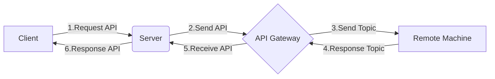

## 问题描述

基于Docker搭建的项目生产环境，在阿里云ECS上访问所有开放端口的API均正常使用。但是在客户现场部署于内网生产环境时，总有一个API执行失败。这个API也比较特殊，使用流程图说明：



> 整个流程属于一个大的内网环境（禁止外部访问），
>
> 其中Client/Server/API Gateway同属于一个内网服务器，Remote Machine属于远程设备。
>
> **内网环境存在一层防火墙，限制这台内网服务器与远程设备的通信，仅开放了一个的端口进行远程通信。**

所有直来直去的API均可以正常工作，只有一个获取远程设备图片并`读取图片`然后BASE64编码后返回给客户端的API一直报错。

`Server层提供接口给Remote Machine上传本地图片并返回图片地址（存储在Server本地），然后Remote Machine拿着这个图片地址再返回给Server层`

Server层也可以顺利拿到Remote Machine返回的图片地址，但是Server层对图片地址进行`读取`就开始出现报错了（如果Server层直接返回图片地址给Client，浏览器客户端可以正常查看这个图片地址）。

```java
import java.net.URL;
import javax.imageio.ImageIO;

// x.x.x.x就是Server层的主机地址
URL imageUrl = "http://x.x.x.x/images/xxxx.jpg"
// read报错
ImageIO.read(imageUrl)
```

```
Can't get input stream from URL!

javax.imageio.IIOException: Can't get input stream from URL!
	at javax.imageio.ImageIO.read(ImageIO.java:1395)
	at sun.reflect.NativeMethodAccessorImpl.invoke0(Native Method)
	at sun.reflect.NativeMethodAccessorImpl.invoke(NativeMethodAccessorImpl.java:62)
	at sun.reflect.DelegatingMethodAccessorImpl.invoke(DelegatingMethodAccessorImpl.java:43)
	at java.lang.reflect.Method.invoke(Method.java:498)
	at org.springframework.web.method.support.InvocableHandlerMethod.doInvoke(InvocableHandlerMethod.java:215)
	at org.springframework.web.method.support.InvocableHandlerMethod.invokeForRequest(InvocableHandlerMethod.java:142)
	at org.springframework.web.servlet.mvc.method.annotation.ServletInvocableHandlerMethod.invokeAndHandle(ServletInvocableHandlerMethod.java:102)
	at org.springframework.web.servlet.mvc.method.annotation.RequestMappingHandlerAdapter.invokeHandlerMethod(RequestMappingHandlerAdapter.java:895)
	at org.springframework.web.servlet.mvc.method.annotation.RequestMappingHandlerAdapter.handleInternal(RequestMappingHandlerAdapter.java:800)
	at org.springframework.web.servlet.mvc.method.AbstractHandlerMethodAdapter.handle(AbstractHandlerMethodAdapter.java:87)
	at org.springframework.web.servlet.DispatcherServlet.doDispatch(DispatcherServlet.java:1038)
	at org.springframework.web.servlet.DispatcherServlet.doService(DispatcherServlet.java:942)
	at org.springframework.web.servlet.FrameworkServlet.processRequest(FrameworkServlet.java:998)
	at org.springframework.web.servlet.FrameworkServlet.doPost(FrameworkServlet.java:901)
	at javax.servlet.http.HttpServlet.service(HttpServlet.java:660)
	at org.springframework.web.servlet.FrameworkServlet.service(FrameworkServlet.java:875)
	at javax.servlet.http.HttpServlet.service(HttpServlet.java:741)
	at org.apache.catalina.core.ApplicationFilterChain.internalDoFilter(ApplicationFilterChain.java:231)
	at org.apache.catalina.core.ApplicationFilterChain.doFilter(ApplicationFilterChain.java:166)
	at org.apache.tomcat.websocket.server.WsFilter.doFilter(WsFilter.java:53)
	at org.apache.catalina.core.ApplicationFilterChain.internalDoFilter(ApplicationFilterChain.java:193)
	at org.apache.catalina.core.ApplicationFilterChain.doFilter(ApplicationFilterChain.java:166)
	at com.github.xiaoymin.swaggerbootstrapui.filter.SecurityBasicAuthFilter.doFilter(SecurityBasicAuthFilter.java:84)
	at org.apache.catalina.core.ApplicationFilterChain.internalDoFilter(ApplicationFilterChain.java:193)
	at org.apache.catalina.core.ApplicationFilterChain.doFilter(ApplicationFilterChain.java:166)
	at com.github.xiaoymin.swaggerbootstrapui.filter.ProductionSecurityFilter.doFilter(ProductionSecurityFilter.java:53)
	at org.apache.catalina.core.ApplicationFilterChain.internalDoFilter(ApplicationFilterChain.java:193)
	at org.apache.catalina.core.ApplicationFilterChain.doFilter(ApplicationFilterChain.java:166)
	at org.apache.catalina.core.ApplicationFilterChain.internalDoFilter(ApplicationFilterChain.java:193)
	at org.apache.catalina.core.ApplicationFilterChain.doFilter(ApplicationFilterChain.java:166)
	at org.springframework.web.filter.CorsFilter.doFilterInternal(CorsFilter.java:96)
	at org.springframework.web.filter.OncePerRequestFilter.doFilter(OncePerRequestFilter.java:107)
	at org.apache.catalina.core.ApplicationFilterChain.internalDoFilter(ApplicationFilterChain.java:193)
	at org.apache.catalina.core.ApplicationFilterChain.doFilter(ApplicationFilterChain.java:166)
	at org.springframework.web.filter.RequestContextFilter.doFilterInternal(RequestContextFilter.java:99)
	at org.springframework.web.filter.OncePerRequestFilter.doFilter(OncePerRequestFilter.java:107)
	at org.apache.catalina.core.ApplicationFilterChain.internalDoFilter(ApplicationFilterChain.java:193)
	at org.apache.catalina.core.ApplicationFilterChain.doFilter(ApplicationFilterChain.java:166)
	at org.springframework.web.filter.FormContentFilter.doFilterInternal(FormContentFilter.java:92)
	at org.springframework.web.filter.OncePerRequestFilter.doFilter(OncePerRequestFilter.java:107)
	at org.apache.catalina.core.ApplicationFilterChain.internalDoFilter(ApplicationFilterChain.java:193)
	at org.apache.catalina.core.ApplicationFilterChain.doFilter(ApplicationFilterChain.java:166)
	at org.springframework.web.filter.HiddenHttpMethodFilter.doFilterInternal(HiddenHttpMethodFilter.java:93)
	at org.springframework.web.filter.OncePerRequestFilter.doFilter(OncePerRequestFilter.java:107)
	at org.apache.catalina.core.ApplicationFilterChain.internalDoFilter(ApplicationFilterChain.java:193)
	at org.apache.catalina.core.ApplicationFilterChain.doFilter(ApplicationFilterChain.java:166)
	at org.springframework.web.filter.CharacterEncodingFilter.doFilterInternal(CharacterEncodingFilter.java:200)
	at org.springframework.web.filter.OncePerRequestFilter.doFilter(OncePerRequestFilter.java:107)
	at org.apache.catalina.core.ApplicationFilterChain.internalDoFilter(ApplicationFilterChain.java:193)
	at org.apache.catalina.core.ApplicationFilterChain.doFilter(ApplicationFilterChain.java:166)
	at org.apache.catalina.core.StandardWrapperValve.invoke(StandardWrapperValve.java:199)
	at org.apache.catalina.core.StandardContextValve.invoke(StandardContextValve.java:96)
	at org.apache.catalina.authenticator.AuthenticatorBase.invoke(AuthenticatorBase.java:490)
	at org.apache.catalina.core.StandardHostValve.invoke(StandardHostValve.java:139)
	at org.apache.catalina.valves.ErrorReportValve.invoke(ErrorReportValve.java:92)
	at org.apache.catalina.core.StandardEngineValve.invoke(StandardEngineValve.java:74)
	at org.apache.catalina.connector.CoyoteAdapter.service(CoyoteAdapter.java:343)
	at org.apache.coyote.http11.Http11Processor.service(Http11Processor.java:408)
	at org.apache.coyote.AbstractProcessorLight.process(AbstractProcessorLight.java:66)
	at org.apache.coyote.AbstractProtocol$ConnectionHandler.process(AbstractProtocol.java:770)
	at org.apache.tomcat.util.net.NioEndpoint$SocketProcessor.doRun(NioEndpoint.java:1415)
	at org.apache.tomcat.util.net.SocketProcessorBase.run(SocketProcessorBase.java:49)
	at java.util.concurrent.ThreadPoolExecutor.runWorker(ThreadPoolExecutor.java:1142)
	at java.util.concurrent.ThreadPoolExecutor$Worker.run(ThreadPoolExecutor.java:617)
	at org.apache.tomcat.util.threads.TaskThread$WrappingRunnable.run(TaskThread.java:61)
	at java.lang.Thread.run(Thread.java:745)
Caused by: java.net.NoRouteToHostException: No route to host (Host unreachable)
	at java.net.PlainSocketImpl.socketConnect(Native Method)
	at java.net.AbstractPlainSocketImpl.doConnect(AbstractPlainSocketImpl.java:350)
	at java.net.AbstractPlainSocketImpl.connectToAddress(AbstractPlainSocketImpl.java:206)
	at java.net.AbstractPlainSocketImpl.connect(AbstractPlainSocketImpl.java:188)
	at java.net.SocksSocketImpl.connect(SocksSocketImpl.java:392)
	at java.net.Socket.connect(Socket.java:589)
	at java.net.Socket.connect(Socket.java:538)
	at sun.net.NetworkClient.doConnect(NetworkClient.java:180)
	at sun.net.www.http.HttpClient.openServer(HttpClient.java:432)
	at sun.net.www.http.HttpClient.openServer(HttpClient.java:527)
	at sun.net.www.http.HttpClient.<init>(HttpClient.java:211)
	at sun.net.www.http.HttpClient.New(HttpClient.java:308)
	at sun.net.www.http.HttpClient.New(HttpClient.java:326)
	at sun.net.www.protocol.http.HttpURLConnection.getNewHttpClient(HttpURLConnection.java:1202)
	at sun.net.www.protocol.http.HttpURLConnection.plainConnect0(HttpURLConnection.java:1138)
	at sun.net.www.protocol.http.HttpURLConnection.plainConnect(HttpURLConnection.java:1032)
	at sun.net.www.protocol.http.HttpURLConnection.connect(HttpURLConnection.java:966)
	at sun.net.www.protocol.http.HttpURLConnection.getInputStream0(HttpURLConnection.java:1546)
	at sun.net.www.protocol.http.HttpURLConnection.getInputStream(HttpURLConnection.java:1474)
	at java.net.URL.openStream(URL.java:1045)
	at javax.imageio.ImageIO.read(ImageIO.java:1393)
	... 70 common frames omitted
```

> 通过报错的开始可以定位：
>
> ```
> javax.imageio.IIOException: Can't get input stream from URL!
> 	at javax.imageio.ImageIO.read(ImageIO.java:1395)
> ```
>
> 查看定位的`ImageIO`的源码：
>
> ```java
> try {
>  istream = input.openStream();
> } catch (IOException e) {
> 	throw new IIOException("Can't get input stream from URL!", e);
> }
> ```
>
> 或者在报错的最后也可以看到`ImageIO`和`URL`源码的相关定位：
>
> ```
> at sun.net.www.protocol.http.HttpURLConnection.getInputStream(HttpURLConnection.java:1474)
> 	at java.net.URL.openStream(URL.java:1045)
> 	at javax.imageio.ImageIO.read(ImageIO.java:1393)
> 	... 70 common frames omitted
> ```
>
> 所以换一种读取方式，来打印的更详细的报错信息。

```java
import java.net.URL;
import javax.imageio.ImageIO;

// x.x.x.x就是Server层的主机地址
URL imageUrl = "http://x.x.x.x/images/xxxx.jpg"
// openStream报错
ImageIO.read(imageUrl.openStream())
```

```
No route to host (Host unreachable)

java.net.NoRouteToHostException: No route to host (Host unreachable)
	at java.net.PlainSocketImpl.socketConnect(Native Method)
	at java.net.AbstractPlainSocketImpl.doConnect(AbstractPlainSocketImpl.java:350)
	at java.net.AbstractPlainSocketImpl.connectToAddress(AbstractPlainSocketImpl.java:206)
	at java.net.AbstractPlainSocketImpl.connect(AbstractPlainSocketImpl.java:188)
	at java.net.SocksSocketImpl.connect(SocksSocketImpl.java:392)
	at java.net.Socket.connect(Socket.java:589)
	at java.net.Socket.connect(Socket.java:538)
	at sun.net.NetworkClient.doConnect(NetworkClient.java:180)
	at sun.net.www.http.HttpClient.openServer(HttpClient.java:432)
	at sun.net.www.http.HttpClient.openServer(HttpClient.java:527)
	at sun.net.www.http.HttpClient.<init>(HttpClient.java:211)
	at sun.net.www.http.HttpClient.New(HttpClient.java:308)
	at sun.net.www.http.HttpClient.New(HttpClient.java:326)
	at sun.net.www.protocol.http.HttpURLConnection.getNewHttpClient(HttpURLConnection.java:1202)
	at sun.net.www.protocol.http.HttpURLConnection.plainConnect0(HttpURLConnection.java:1138)
	at sun.net.www.protocol.http.HttpURLConnection.plainConnect(HttpURLConnection.java:1032)
	at sun.net.www.protocol.http.HttpURLConnection.connect(HttpURLConnection.java:966)
	at sun.net.www.protocol.http.HttpURLConnection.getInputStream0(HttpURLConnection.java:1546)
	at sun.net.www.protocol.http.HttpURLConnection.getInputStream(HttpURLConnection.java:1474)
	at java.net.URL.openStream(URL.java:1045)
	at sun.reflect.NativeMethodAccessorImpl.invoke0(Native Method)
	at sun.reflect.NativeMethodAccessorImpl.invoke(NativeMethodAccessorImpl.java:62)
	at sun.reflect.DelegatingMethodAccessorImpl.invoke(DelegatingMethodAccessorImpl.java:43)
	at java.lang.reflect.Method.invoke(Method.java:498)
	at org.springframework.web.method.support.InvocableHandlerMethod.doInvoke(InvocableHandlerMethod.java:215)
	at org.springframework.web.method.support.InvocableHandlerMethod.invokeForRequest(InvocableHandlerMethod.java:142)
	at org.springframework.web.servlet.mvc.method.annotation.ServletInvocableHandlerMethod.invokeAndHandle(ServletInvocableHandlerMethod.java:102)
	at org.springframework.web.servlet.mvc.method.annotation.RequestMappingHandlerAdapter.invokeHandlerMethod(RequestMappingHandlerAdapter.java:895)
	at org.springframework.web.servlet.mvc.method.annotation.RequestMappingHandlerAdapter.handleInternal(RequestMappingHandlerAdapter.java:800)
	at org.springframework.web.servlet.mvc.method.AbstractHandlerMethodAdapter.handle(AbstractHandlerMethodAdapter.java:87)
	at org.springframework.web.servlet.DispatcherServlet.doDispatch(DispatcherServlet.java:1038)
	at org.springframework.web.servlet.DispatcherServlet.doService(DispatcherServlet.java:942)
	at org.springframework.web.servlet.FrameworkServlet.processRequest(FrameworkServlet.java:998)
	at org.springframework.web.servlet.FrameworkServlet.doPost(FrameworkServlet.java:901)
	at javax.servlet.http.HttpServlet.service(HttpServlet.java:660)
	at org.springframework.web.servlet.FrameworkServlet.service(FrameworkServlet.java:875)
	at javax.servlet.http.HttpServlet.service(HttpServlet.java:741)
	at org.apache.catalina.core.ApplicationFilterChain.internalDoFilter(ApplicationFilterChain.java:231)
	at org.apache.catalina.core.ApplicationFilterChain.doFilter(ApplicationFilterChain.java:166)
	at org.apache.tomcat.websocket.server.WsFilter.doFilter(WsFilter.java:53)
	at org.apache.catalina.core.ApplicationFilterChain.internalDoFilter(ApplicationFilterChain.java:193)
	at org.apache.catalina.core.ApplicationFilterChain.doFilter(ApplicationFilterChain.java:166)
	at com.github.xiaoymin.swaggerbootstrapui.filter.SecurityBasicAuthFilter.doFilter(SecurityBasicAuthFilter.java:84)
	at org.apache.catalina.core.ApplicationFilterChain.internalDoFilter(ApplicationFilterChain.java:193)
	at org.apache.catalina.core.ApplicationFilterChain.doFilter(ApplicationFilterChain.java:166)
	at com.github.xiaoymin.swaggerbootstrapui.filter.ProductionSecurityFilter.doFilter(ProductionSecurityFilter.java:53)
	at org.apache.catalina.core.ApplicationFilterChain.internalDoFilter(ApplicationFilterChain.java:193)
	at org.apache.catalina.core.ApplicationFilterChain.doFilter(ApplicationFilterChain.java:166)
	at org.apache.catalina.core.ApplicationFilterChain.internalDoFilter(ApplicationFilterChain.java:193)
	at org.apache.catalina.core.ApplicationFilterChain.doFilter(ApplicationFilterChain.java:166)
	at org.springframework.web.filter.CorsFilter.doFilterInternal(CorsFilter.java:96)
	at org.springframework.web.filter.OncePerRequestFilter.doFilter(OncePerRequestFilter.java:107)
	at org.apache.catalina.core.ApplicationFilterChain.internalDoFilter(ApplicationFilterChain.java:193)
	at org.apache.catalina.core.ApplicationFilterChain.doFilter(ApplicationFilterChain.java:166)
	at org.springframework.web.filter.RequestContextFilter.doFilterInternal(RequestContextFilter.java:99)
	at org.springframework.web.filter.OncePerRequestFilter.doFilter(OncePerRequestFilter.java:107)
	at org.apache.catalina.core.ApplicationFilterChain.internalDoFilter(ApplicationFilterChain.java:193)
	at org.apache.catalina.core.ApplicationFilterChain.doFilter(ApplicationFilterChain.java:166)
	at org.springframework.web.filter.FormContentFilter.doFilterInternal(FormContentFilter.java:92)
	at org.springframework.web.filter.OncePerRequestFilter.doFilter(OncePerRequestFilter.java:107)
	at org.apache.catalina.core.ApplicationFilterChain.internalDoFilter(ApplicationFilterChain.java:193)
	at org.apache.catalina.core.ApplicationFilterChain.doFilter(ApplicationFilterChain.java:166)
	at org.springframework.web.filter.HiddenHttpMethodFilter.doFilterInternal(HiddenHttpMethodFilter.java:93)
	at org.springframework.web.filter.OncePerRequestFilter.doFilter(OncePerRequestFilter.java:107)
	at org.apache.catalina.core.ApplicationFilterChain.internalDoFilter(ApplicationFilterChain.java:193)
	at org.apache.catalina.core.ApplicationFilterChain.doFilter(ApplicationFilterChain.java:166)
	at org.springframework.web.filter.CharacterEncodingFilter.doFilterInternal(CharacterEncodingFilter.java:200)
	at org.springframework.web.filter.OncePerRequestFilter.doFilter(OncePerRequestFilter.java:107)
	at org.apache.catalina.core.ApplicationFilterChain.internalDoFilter(ApplicationFilterChain.java:193)
	at org.apache.catalina.core.ApplicationFilterChain.doFilter(ApplicationFilterChain.java:166)
	at org.apache.catalina.core.StandardWrapperValve.invoke(StandardWrapperValve.java:199)
	at org.apache.catalina.core.StandardContextValve.invoke(StandardContextValve.java:96)
	at org.apache.catalina.authenticator.AuthenticatorBase.invoke(AuthenticatorBase.java:490)
	at org.apache.catalina.core.StandardHostValve.invoke(StandardHostValve.java:139)
	at org.apache.catalina.valves.ErrorReportValve.invoke(ErrorReportValve.java:92)
	at org.apache.catalina.core.StandardEngineValve.invoke(StandardEngineValve.java:74)
	at org.apache.catalina.connector.CoyoteAdapter.service(CoyoteAdapter.java:343)
	at org.apache.coyote.http11.Http11Processor.service(Http11Processor.java:408)
	at org.apache.coyote.AbstractProcessorLight.process(AbstractProcessorLight.java:66)
	at org.apache.coyote.AbstractProtocol$ConnectionHandler.process(AbstractProtocol.java:770)
	at org.apache.tomcat.util.net.NioEndpoint$SocketProcessor.doRun(NioEndpoint.java:1415)
	at org.apache.tomcat.util.net.SocketProcessorBase.run(SocketProcessorBase.java:49)
	at java.util.concurrent.ThreadPoolExecutor.runWorker(ThreadPoolExecutor.java:1142)
	at java.util.concurrent.ThreadPoolExecutor$Worker.run(ThreadPoolExecutor.java:617)
	at org.apache.tomcat.util.threads.TaskThread$WrappingRunnable.run(TaskThread.java:61)
	at java.lang.Thread.run(Thread.java:745)
```

## 问题分析

`No route to host (Host unreachable)`

- 没有到主机的路由(主机不可到达)

奇怪的问题就在这，为什么自己请求自己还不可达呢？

内网的防火墙都已经开放了这个访问端口，怎么还不通呢？

答案是Server服务器自带的`firewalld.service`已开启。

**解决方法：**

- 直接关掉防火墙，但不安全，`不推荐`

  ```sh
  service firewalld stop
  # or
  systemctl stop firewalld.service
  ```

- 使用`firewall-cmd`添加需要使用的端口，安全且便于管理已开放的端口号，`推荐`

  > **注意:** 新增/删除端口需要重载/重启防火墙服务
  >
  > ```sh
  > # 重载防火墙
  > firewall-cmd --reload
  > 
  > # 重启防火墙
  > service firewalld restart
  > # or
  > systemctl restart firewalld.service
  > ```

  ```sh
  # 永久性开放一个端口
  firewall-cmd --zone=public --add-port=8998/tcp --permanent
  # 加载已添加端口
  firewall-cmd --reload
  # 查看防火墙开放的端口信息
  firewall-cmd --list-ports
  
  # 删除开放的端口信息
  firewall-cmd --zone=public --remove-port=80/tcp --permanent
  # 重载防火墙
  firewall-cmd --reload
  # 查看防火墙开放的端口信息
  firewall-cmd --list-ports
  ```

至此，`No route to host (Host unreachable)`问题就迎刃而解了。